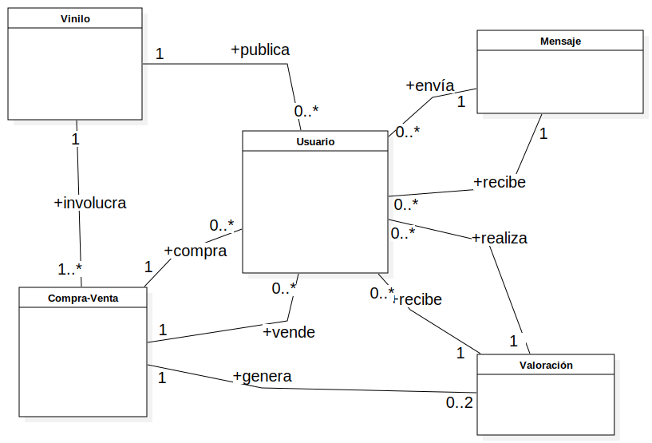

# La Phonoteka

## Team Members

| Name | Surname | Email | GitHub |
| ------ | --------- | ------ | ------- |
| Adrián | Morales | a.morales.2019@alumnos.urjc.es | Adri-md-1208 |

# Preparation 1: Project Definition

## Project Overview
La Phonoteka is an online platform dedicated to the buying and selling of vinyl records. It allows users to register, list vinyl records for sale, make purchases, and rate other users.

## Entities

### User
Represents a registered person on the platform.

### Vinyl
Represents an item that can be bought or sold on the platform.

### Transaction
Represents a buying or selling action of a Vinyl entity.

### Rating
Represents a review/rating given by a User to another User after a Transaction has taken place between them.

The relationship exists because a User makes a Transaction for a Vinyl and can receive/give a Rating.

## User Permissions

| Feature | Anonymous | Registered | Administrator | Description |
| :--- | :---: | :---: | :---: | :--- |
| **View vinyl records** | Yes | Yes | Yes | Everyone can see the available vinyl records. |
| **Search vinyl records** | Yes | Yes | Yes | Search by artist, title, genre, etc. |
| **View vinyl details** | Yes | Yes | Yes | Access to the complete information of a vinyl record. |
| **Register** | Yes | No | No | Only anonymous users can register. |
| **Log in** | Yes | No | No | Only anonymous users can log in. |
| **Log out** | No | Yes | Yes | |
| **List vinyl for sale** | No | Yes | Yes | A registered user can put their vinyl records up for sale. |
| **Edit/Delete own vinyl** | No | Yes | Yes | Only the owner of the vinyl or an administrator can edit/delete it. |
| **Buy a vinyl** | No | Yes | Yes | Registered users can make purchases. |
| **View purchase/sale history** | No | Yes | Yes | Each user sees their own history. |
| **Leave a rating** | No | Yes | Yes | Rate transactions or other users. |
| **Modify own profile** | No | Yes | Yes | Change personal data, avatar, etc. |
| **Manage all vinyl records** | No | No | Yes | Full CRUD on all vinyl records on the platform. |
| **Manage all users** | No | No | Yes | Full CRUD on all users on the platform. |
| **View platform statistics** | No | No | Yes | Access to the system's charts and metrics. |

## Images

The application contains several types of images:

- **Profile picture**: Optional photo that can be uploaded when creating or modifying a profile. 1 user has 0 or 1 photos.
- **Vinyl picture**: Mandatory photo of the vinyl the user is going to sell. 1 Vinyl has 1 photo.

## Charts

The application will offer charts to administrators so they can have a general overview of the platform's status:

- **Sales over time** (line chart)
- **New user registrations** (line chart)
- **Vinyl distribution based on attributes** (pie chart)
- **Top selling and top buying users** (ranking chart)

## Complementary Technology
Automated email sending to notify users when their vinyl has been sold or when they have received a comment/rating.

## Advanced Algorithm or Query
Vinyl recommendations for registered users while they are viewing a vinyl record. They will appear at the bottom of the page. Recommendations will be based on the attributes of the vinyl records they have already purchased.
